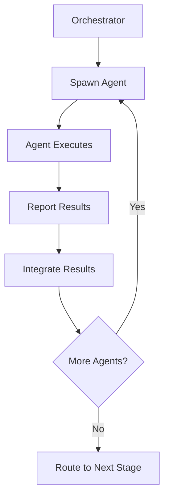

# JueFlow - Automated Reliable Workflows for Clawdbot

Inspired by [Get Shit Done](https://github.com/glittercowboy/get-shit-done)

---

## What It Solves

**Context Rot:** AI quality degrades as context window fills → inconsistent, buggy code

**JueFlow Solution:**
- Fresh context windows per task (200k tokens pure implementation)
- Multi-agent orchestration (parallel researchers, atomic executors)
- State tracking (PROJECT.md, STATE.md, REQUIREMENTS.md, ROADMAP.md)
- Atomic git commits (surgical, traceable, meaningful)
- Verification before completion (goals checked against actual output)

---

## Core Philosophy

1. **Complexity in system, simplicity in interface** - You see 3 commands, system handles the rest
2. **Fresh context every time** - No "I'll be more concise now" degradation
3. **Parallel execution** - Independent tasks run simultaneously, dependent tasks sequential
4. **Verification before trust** - Goals checked against codebase, not assumed complete
5. **Walk away, come back done** - Run overnight, wake up to verified work

---

## Architecture

### Agent System

| Agent | Role | Runs When |
|--------|------|----------|
| **Project Researcher** | Surveys domain, finds ecosystem, maps features | `/jf:new-project`, `/jf:new-milestone` |
| **Phase Researcher** | Deep dive into specific phase implementation options | `/jf:plan-phase N` |
| **Planner** | Creates atomic task plans with XML structure | `/jf:plan-phase N` |
| **Executor** | Implements tasks, each with fresh context | `/jf:execute-phase N` |
| **Verifier** | Confirms code delivers what was promised | `/jf:verify-work N` |
| **Debugger** | Diagnoses failures systematically | Auto-triggered on verification fail |

### Orchestrator Pattern



Each stage follows same pattern:
1. Thin orchestrator spawns specialized agents
2. Waits for all to complete
3. Integrates results
4. Routes to next stage

**Result:** Your main context stays at 30-40%. Work happens in fresh subagent contexts.

---

## File Structure

```
.planning/
├── PROJECT.md           # Project vision, always loaded
├── STATE.md            # Decisions, blockers, position
├── REQUIREMENTS.md     # Scoped v1/v2 requirements
├── ROADMAP.md          # Phases, milestones, progress
├── research/           # Ecosystem research
│   ├── SUMMARY.md
│   ├── STACK.md
│   ├── FEATURES.md
│   ├── ARCHITECTURE.md
│   └── PITFALLS.md
├── phases/
│   ├── phase1-CONTEXT.md       # Your decisions before planning
│   ├── phase1-RESEARCH.md      # Research findings
│   ├── phase1-1-PLAN.md        # Atomic task plan
│   ├── phase1-1-SUMMARY.md    # What happened
│   └── phase1-VERIFICATION.md # Goals vs reality
├── quick/              # Ad-hoc tasks
│   └── 001-fix-bug/
│       ├── PLAN.md
│       └── SUMMARY.md
└── config.json         # Settings (mode, profiles, workflows)
```

---

## Workflow

### 1. New Project

```
/jf:new-project "Build X"
```

**Flow:**
1. Questions → Understand goals, constraints, preferences
2. Project Researcher → Surveys ecosystem, writes research/
3. Requirements Extract → v1 vs v2 vs out-of-scope
4. Roadmap → Phases mapped to requirements
5. You approve → Ready to build

**Creates:** PROJECT.md, REQUIREMENTS.md, ROADMAP.md, STATE.md, research/

---

### 2. Discuss Phase

```
/jf:discuss-phase 1
```

**Flow:**
1. Analyzes phase requirements
2. Identifies gray areas (visual, APIs, content, organization)
3. Asks about each until satisfied
4. Creates CONTEXT.md

**Creates:** phase1-CONTEXT.md

**Why:** Planner knows your decisions, Researcher investigates right patterns.

---

### 3. Plan Phase

```
/jf:plan-phase 1
```

**Flow:**
1. Phase Researcher → Investigates implementation options
2. Planner → Creates 2-3 atomic task plans with XML
3. Plan Checker → Verifies plans achieve phase goals
4. Loop until pass

**Creates:** phase1-RESEARCH.md, phase1-1-PLAN.md, phase1-2-PLAN.md, ...

---

### 4. Execute Phase

```
/jf:execute-phase 1
```

**Flow:**
1. Groups plans into waves (parallel vs sequential)
2. Spawns executors, each with fresh 200k context
3. Each executor: implements → tests → commits
4. Tracks progress, shows real-time updates

**Creates:** phase1-1-SUMMARY.md, phase1-2-SUMMARY.md, ... + git commits

---

### 5. Verify Work

```
/jf:verify-work 1
```

**Flow:**
1. Extracts testable deliverables
2. Walks you through: "Can you login with email?" Yes/no/describe
3. Fail → Spawns Debugger → Diagnoses → Creates fix plans
4. All pass → Move to next phase

**Creates:** phase1-UAT.md, fix plans if issues found

---

### 6. Complete Milestone

```
/jf:complete-milestone
```

**Flow:**
1. Verify all phases done
2. Tag release (git tag + ROADMAP archive)
3. Archive milestone docs
4. Ready for next milestone

---

### 7. Quick Mode (Ad-hoc)

```
/jf:quick "Fix login bug"
```

**Flow:**
1. Planner → Creates atomic task plan
2. Executor → Implements, tests, commits
3. No research, no verification (faster path)

**Creates:** .planning/quick/001-fix-login-bug/PLAN.md, SUMMARY.md

---

## XML Task Format

Every plan uses XML optimized for LLMs:

```xml
<task type="auto">
  <name>Create login endpoint</name>
  <files>src/app/api/auth/login/route.ts</files>
  <action>
    Use jose for JWT (not jsonwebtoken - CommonJS issues).
    Validate credentials against users table.
    Return httpOnly cookie on success.
  </action>
  <verify>curl -X POST localhost:3000/api/auth/login returns 200 + Set-Cookie</verify>
  <done>Valid credentials return cookie, invalid return 401</done>
</task>
```

Precise instructions. No guessing. Verification built in.

---

## Configuration

`.planning/config.json`:

```json
{
  "mode": "interactive",
  "depth": "standard",
  "profiles": {
    "planning": "quality",
    "execution": "balanced",
    "verification": "standard"
  },
  "workflows": {
    "research": true,
    "plan_check": true,
    "verifier": true
  },
  "execution": {
    "parallel": true,
    "commit_docs": true
  }
}
```

**Mode:** `yolo` (auto-approve) or `interactive` (confirm each step)
**Depth:** `quick`, `standard`, or `comprehensive`
**Profiles:** Balance quality vs token cost

---

## Overnight Execution

**Scenario:** Mathias sleeps 8 hours, Jue builds entire milestone

```
Before sleep:
1. /jf:new-project "Build X"
2. /jf:discuss-phase 1
3. /jf:plan-phase 1

Sleep 8 hours → Jue runs autonomously:
4. /jf:execute-phase 1 (all night)
5. /jf:verify-work 1 (morning)

Wake up → Verified work, clean git history, ready to ship
```

---

## Integration with Existing Automations

JueFlow integrates with current system:

| Current Automation | Integration |
|-----------------|--------------|
| Competitive Intelligence | Feeds into Project Researcher domain knowledge |
| Trend-Based Ideas | Generates project candidates for `/jf:new-project` |
| Weekly Learnings | Updates STATE.md with patterns discovered |
| Auto-commit | Used by Executor for atomic commits |

---

## Commands Reference

### Core Workflow
- `/jf:new-project [desc]` - Initialize new project
- `/jf:discuss-phase [N]` - Capture implementation decisions
- `/jf:plan-phase [N]` - Research + plan
- `/jf:execute-phase [N]` - Execute all tasks
- `/jf:verify-work [N]` - Manual verification
- `/jf:complete-milestone` - Archive, tag, next

### Quick Tasks
- `/jf:quick [desc]` - Ad-hoc with atomic guarantees

### Navigation
- `/jf:progress` - Where am I? What's next?
- `/jf:help` - All commands

### Session Management
- `/jf:pause-work` - Handoff for break
- `/jf:resume-work` - Continue from last session

### Utilities
- `/jf:settings` - Configure system
- `/jf:set-profile [profile]` - Switch quality/balanced/budget
- `/jf:map-codebase` - Analyze existing project

---

## Why This Works

1. **Fresh Context Every Task** - No accumulation, no degradation
2. **Multi-Agent Parallelism** - Independent tasks run simultaneously
3. **Atomic Verification** - Each task verified before commit
4. **Clean Git History** - Bisect works, rollback is surgical
5. **Walk Away, Come Back Done** - Full autonomy

---

*Built by Jue for Mathias 🧙‍♂️*
